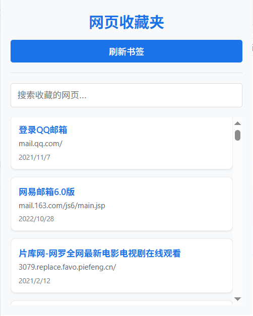
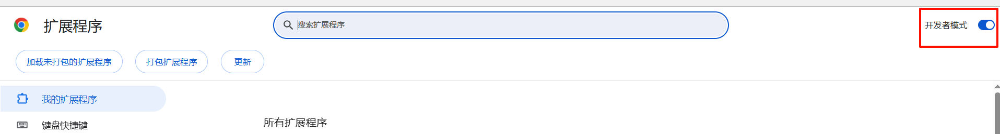

# Chrome 收藏夹查看器

一个简洁高效的 Chrome 浏览器扩展，帮助您快速查看和管理 Chrome 书签。

## ✨ 功能特性

- 📑 **快速查看书签** - 一键打开弹窗，浏览所有 Chrome 书签
- 🔍 **实时搜索** - 支持按标题或 URL 搜索收藏的网页
- 🔄 **即时刷新** - 点击按钮即可刷新书签列表
- 📅 **智能日期** - 显示相对日期（今天、昨天、X 天前）
- 🎨 **精美界面** - 现代化 UI 设计，简洁美观
- 🔗 **快捷访问** - 点击书签即可在新标签页打开



## 📦 安装方法

### 方式一：加载已解压的扩展程序

1. 克隆或下载本项目到本地
2. 打开 Chrome 浏览器，访问 `chrome://extensions/`
3. 开启右上角的 **开发者模式**



1. 点击 **加载已解压的扩展程序**
2. 选择本项目所在文件夹即可

### 方式二：CRX 文件安装（待发布）

> 后续将发布到 Chrome Web Store

## 🚀 使用说明

1. 安装完成后，点击浏览器工具栏中的扩展图标
2. 查看您的所有 Chrome 书签列表
3. 使用搜索框快速查找特定书签
4. 点击 **刷新书签** 按钮同步最新书签
5. 点击任意书签标题即可在新标签页打开

## 📁 项目结构

```
chrome-bookmark-saver-extension/
├── manifest.json          # 扩展配置文件
├── src/
│   └── background.js      # 后台服务，处理书签数据获取
├── popup/
│   ├── index.html         # 弹窗界面
│   ├── script.js          # 弹窗交互逻辑
│   └── styles.css         # 弹窗样式
├── content.js             # 内容脚本（预留页面信息获取功能）
├── types.js               # 类型定义
└── icons/                 # 扩展图标
    ├── icon16.png
    ├── icon32.png
    ├── icon48.png
    └── icon128.png
```

## 🔧 技术栈

- **Manifest V3** - 使用最新的 Chrome 扩展 API
- **原生 JavaScript** - 无需框架，轻量高效
- **Chrome Storage API** - 数据存储
- **Chrome Bookmarks API** - 书签管理

## 🔐 权限说明

| 权限 | 用途 |
|------|------|
| `storage` | 存储扩展配置和缓存数据 |
| `bookmarks` | 读取和管理 Chrome 书签 |

## 🛠️ 开发

### 调试

1. 在 `chrome://extensions/` 页面找到本扩展
2. 点击 **查看视图：popup/index.html** 调试弹窗
3. 点击 **service worker** 调试后台脚本

### 打包

1. 在 `chrome://extensions/` 页面点击 **打包扩展程序**
2. 选择项目根目录
3. 生成 `.crx` 和 `.pem` 文件

## 📝 更新日志

### v1.0.0
- 初始版本发布
- 支持书签列表查看
- 支持搜索功能
- 支持刷新同步

## 📄 许可证

[查看 LICENSE 文件](LICENSE)

## 🤝 贡献

欢迎提交 Issue 和 Pull Request！

## 📧 联系方式

如有问题或建议，请提交 Issue。
